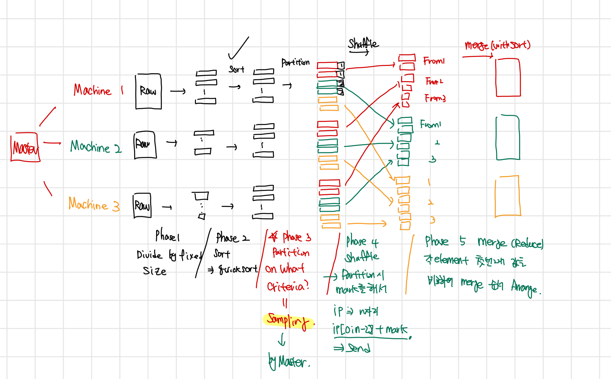

# 2022-11-03

## Progress in Previous Week
1. Distributed Merge Sort 이해
   1. 3명이 다 견해가 다름
      1. 너무 high한 레벨에서 이해했기 때문에 구체적 implementation에 대한 문제 발생
      2. merging은 K-way merge sort를 사용할 예정

2. gRPC 사용 이해

3. 서버 사용 이해 -> 교수님 메일 오면 다시 확인

4. 11/4(목) 미팅 진행
   1. 디자인 패턴 회의
   2. sorting 내용 공유
   3. Scala I/O 작업 

### Milestone:

1st week: 깃 레포지토리 생성

2nd week: 목표 설정 및 스타일 가이드

3rd week: 프로젝트 구조 설계, 디테일한 목표 설정

4th week: 

5th week: 

6th week: 

7th week: 

8th week: 

## Goal of the Week

Class design, Working flow design

Define necessary functionalities for implementing flow

Class implementation in high level

## Goal of the Week for each Member

송수민:
클래스 세부 디자인
ubuntu 환경설정 통일을 위한 doccumentation

임경빈:
gRPC를 사용한 connection 구축
gRPC 간단한 unit test 만들기

염재후:
Scala에서 필요한 모듈/미리 정의된 함수 찾아보기
Sorting module design
# 3rd Week Progress Documentation
### Indigo Team Sumin Song
## 1. Distributed Sorting
- Process Rough Outline
> Phase 1: Divide data by fixed size  
> Phase 2: Sorting  
> Phase 3: Sampling and set criteria (boundary each machine)  
> Phase 4: Partitioning each sorted data  
> Phase 5: Shuffling Phase 4's result to each Machine 
> Phase 6: Merge Sort 

- Materialization Each Phase
> Phase 1: 32MB 단위로 Raw data 분할  
> Phase 2: Sorting은 따로 구현하지 않고 Scala Library에 구현되어 있는 Method 사용  
> Phase 3: 각 Machine 별로 랜덤하게 Sorted Data Fragment에서 (Min,Max) pair N개를 뽑아 Master에 전달 / N개가 몇개가 될지는 상의 필요 / Min, Max pair 대신 선택된 Data Fragment의 Median을 보내는 것은 어떨까?  
> Master에서 받은 각 Pair들을 바탕으로 # of Machine개의 boundary 지정 후 이를 각 Worker에게 전달  
> Phase 4: Sorting된 Data Fragment를 범위를 검사하여 Partitioning / Mark 1,2,3.... => Machine to 1,2,3... 
> Phase 5: Mark 된 각 Data Fragment를 각 Worker에게 전달  
> 1. gRPC에서 Worker간의 연결도 허용할 수 있다면, 각 Worker들이 concurrently하게 shuffling 하는 방안 -> 전제가 성립해야 하며, 만약 Worker가 많아진다면 Overhead 우려  
> 2. gRPC를 통해 이전 Phase들을 진행했다면 각 Worker와 Master간의 통신 line은 정상적으로 작동할 것. -> Master로 일단 보낸 다음 Master에서 각 Worker로 뿌리는 방법  
> PPT를 보아 Master's IP[0:n-2] + Marked # 로 표현하면 될 듯. ex) Marked 2 => Machine 2로 보내져야 함 => 192.168.10. + 2 = 192.168.10.2  
>Phase 6: K - Way Merge Sorting 사용 추진  
> If) 각 shuffling된 Data들이 Skewness가 존재한다면? -> 이웃한 Machine에서 이어받아 붙이거나 넘겨주는 방안

## 2. Apply gRPC Briefly (Prototype?)
 - Process Rough Outline
> 1. Master는 N개의 Worker가 사용된다는 것을 안다고 가정한다. N개의 Worker는 각각 Master에게 준비가 되었다는 request를 보낸다. 이때, Worker가 Master에게 request를 보내는 시점은 Phase 1이 완료 된 시점이다. Master는 N개의 request가 도착하였는지 검사한다.
> 2. N개의 request를 받았다면, 각 Worker에게 Sorting을 시작하라는 respond를 보낸다.
> 3. 각 Worker에서 Sorting이 완료 되었다면, Randomly하게 Sorted Data Fragment를 선택해 boundary를 정할 수 있는 정보를 Master에 request로 보낸다. 이는 Sorting이 각 Worker에서 완료되었음을 의미한다.
> 4. Master에서는 N개의 request를 받았는지 검사한다. 받았다면, 3에서 받은 정보를 통해 각 Worker가 담을 Data의 Range를 지정하고, 이를 각 Worker에게 respond로 보낸다.
> 5. Worker에서는 받은 respond를 이용하여 Partitioning을 진행한다. 완료되었다면 Master에게 request를 보낸다.
> 6. Master는 N개의 request를 받았는지 검사한다. 받았다면, 각 Worker에게 Shuffling을 하라는 respond를 보낸다. Shuffling을 하는 방법은 논의가 필요하다.
> 7. Shuffling이 완료되었다면(아마 위의 2번 방법으로 하여 각 Worker가 Shuffling을 완료하였다는 request를 보내서 완료되었음을 파악하는 것이 좋을 것 같다.), 각 Worker들에게 Merge Sort를 하라는 respond를 보낸다.
> 8. 각 Worker에서 Merge Sort가 완료되면, 완료된 Data의 Size와 함께 request를 보낸다.
> 9. Master는 N개의 request가 오는지 검사하고, 받았다면 Size를 검사하여 Skewness를 검사한다. 검사하여 Balance를 맞추어야 할 것이며, 이 방법은 논의가 필요하다.

## 3. Development Environment
> 현재 쉽게 사용할 수 있는 Resource: 3대의 로컬 컴퓨터, 1개의 Remote Cloud Server(Oracle Instance : Ubuntu 22.04)  
> Ubuntu 22.04로 통일하는 방안 논의 필요.

### GyeongBin Lim
  
Sample Sorting  
N개의 partition에 대해 각 partition마다 sorting을 수행한다. sorting이 된 partition에 대하여 N개 만큼의 element를 sampling한다. 각 partition으로부터 온 sample을 다시 sorting한 뒤 같은 간격의 N개 element를 기준으로 처음의 patition을 shuffle한다. 
이때 partition을 각각의 머신에 들어가는 데이터셋이라고 생각할 수 있는데, 위의 알고리즘을 사용하면 머신마다 들어가는 데이터셋 사이즈에 불균형이 발생할 수 있다. 이러한 경우 worker 머신 사이의 커뮤니케이션을 통해 데이터를 옮겨 머신끼리의 밸런스를 맞출 수 있다.