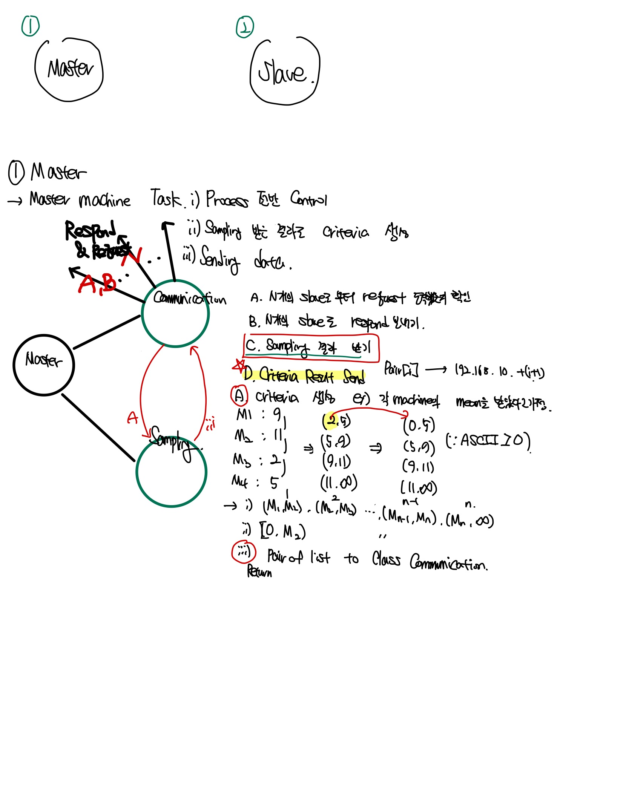
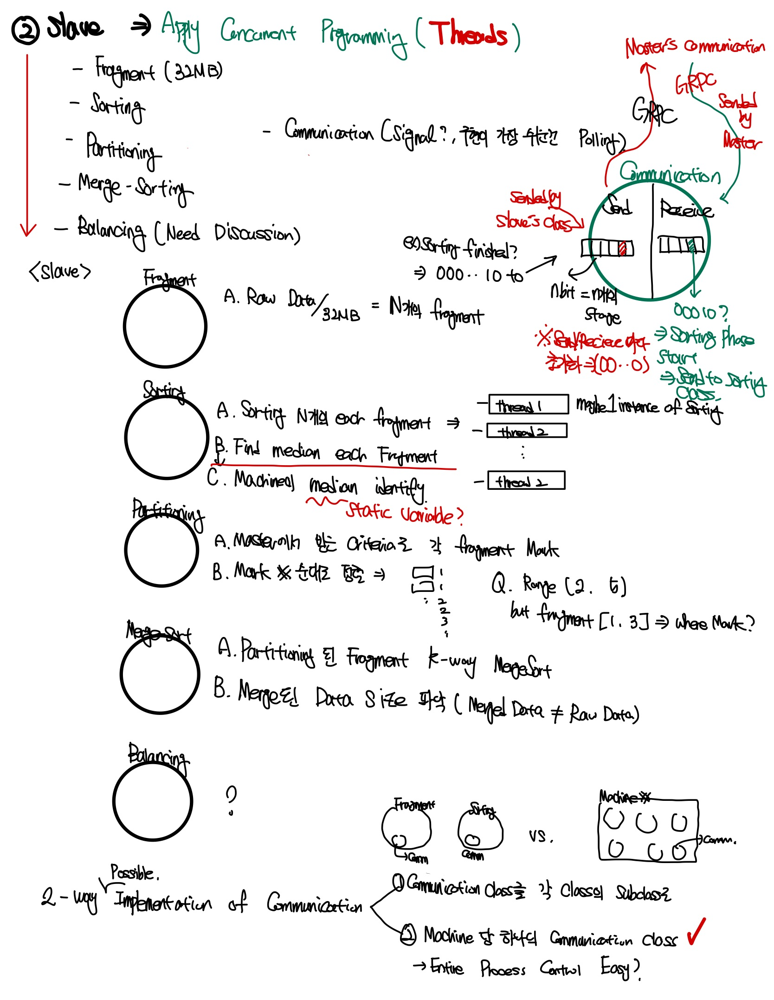
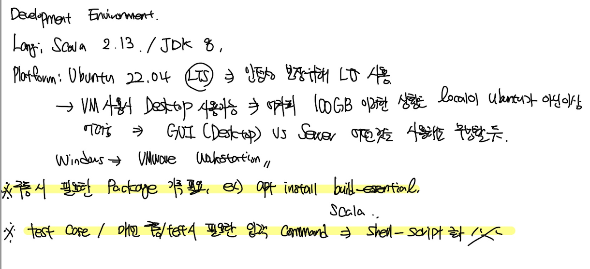
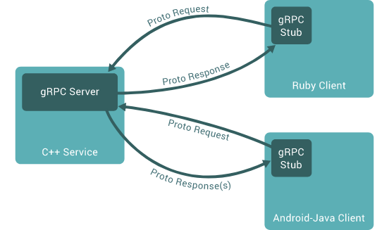

# 2022-11-12

## Progress in Previous Week
Class design, Working flow design => Done

Define necessary functionalities for implementing flow => Done

Class implementation in high level => Done

gRPC 예제 코드 작성 => Done

## Goal of the Week

gRPC 적용 => Master Slave 구조 구현 및 통신 확인

gRPC test code 작성

## Goal of the Week for each Member
송수민: Dependency확인 및 빌드 환경 구축

임경빈: gRPC 코드 작성

염재후: gRPC 코드 작성 및 작동 specification

## Progress of this week
### Sumin Song
 <br>
 <br>
 <br>

### Kyungbin Lim
### gRPC

<aside>
💡 **[gRPC](https://grpc.io/)**는 구글에서 개발한 최신 오픈 소스 고성능 **RPC** 프레임워크이다.

</aside>

<aside>
💡 **RPC** : Remote Procedure Call의 약자로 별도의 원격 제어를 위한 코딩 없이 다른 주소 공간에서 함수나 프로시저를 실행할 수 있게하는 프로세스 간 통신 기술이다.

</aside>

### Introduction to gRPC

[Introduction to gRPC](https://grpc.io/docs/what-is-grpc/introduction/)

### Overview

gRPC에서는 클라이언트 어플리케이션이 서버 어플리케이션에 있는 메소드를 마치 자신의 로컬 오브젝트인 것처럼 호출할 수 있다. 여느 RPC 시스템과 마찬가지로 서비스 정의 개념에 기반을 두고 있으며 parameter와 return 타입을 가지고 원격으로 메소드를 호출할 수 있다. 서버는 이 인터페이스를 구현하고 gRPC서버를 실행하여 클라이언트 호출을 처리한다. 클라이언트는 서버와 동일한 메소드을 제공하는 stub을 가지고 있다.



### Protocol Buffers

구글에서 오픈소스로 공개한 언어, 구조화(structured)된 데이터를 직렬화(serialization) 하는 방식.

<aside>
💡 **직렬화(Serialization)** : 데이터 표현은 결국 비트와 바이트로 이루어짐. 데이터를 바이트 스트림으로 만드는 것도 직렬화, JSON이나 XML과 같은 일정한 표현 형식으로 만드는 것도 직렬화. 프로토콜 버퍼도 데이터를 직렬화시키는 포맷 중 하나.

</aside>

프로토콜 버퍼는 데이터의 크기가 작아 같은 시간에 더 많은 데이터를 보낼 수 있다. 또 별도의 파싱이 필요가 없다. 하지만 인간이 읽기 불편하며 proto파일이 있어야 읽을 수 있다는 단점이 있다. 즉 모든 클라이언트가 proto 파일이 있어야 하므로 내부 서비스간 데이터 교환에서 주로 쓰인다.

### JSON(JavaScript Object Notation)

- 데이터를 저장하거나 전송할 때 많이 사용되는 **경량의 DATA 교환 형식**, 즉 객체를 만들 때 사용하는 표현식을 의미한다.
- JSON은 데이터 포맷일 뿐이며 어떠한 통신 방법도, 프로그래밍 문법도 아닌 단순히 데이터를 표시하는 표현 방법일 뿐이다.

```python
{
  "employees": [
    {
      "name": "Surim",
      "lastName": "Son"
    },
    {
      "name": "Someone",
      "lastName": "Huh"
    },
    {
      "name": "Someone else",
      "lastName": "Kim"
    } 
  ]
}
```

### Working with Protocol Buffers

기본적으로 gRPC는 구조화된 데이터를 직렬화하기 위해 구글의 오픈 소스 메커니즘인 프로토콜 버퍼를 사용한다.

프로토콜 버퍼로 작업할 때 먼저 프로토콜 파일에서 직렬화할 데이터의 구조를 정의한다. 이것은 .proto 확장자를 가진 일반 텍스트 파일.

```java
message Person {
  string name = 1;
  int32 id = 2;
  bool has_ponycopter = 3;
}
```

gRPC에서 사용할 protobuf의 대략적인 모습은 아래와 같다.

```java
syntax = "proto3";

package ecommerce;

service ProductInfo {
    rpc addProduct(Product) returns (ProductID);
    rpc getProduct(ProductID) returns (Product);
}

message Product {
    string id = 1;
    string name = 2;
    string description = 3;
    float price = 4;
}

message ProductID {
    string value = 1;
}
```

자바 기준으로 `service`는 `interface`에 있는 추상메서드 라고 생각하면 편하고 `message`는 Dto, 값 객체라고 생각하면 편하다.

이제 작성한 이 .proto을 각각 언어에 맞는 protoc를 사용해서 컴파일한뒤에 서버측에서는 미리 정의한 `service` 의 구현체를 작성하고 클라이언트에서는 제공되는 `service`의 stub 객체를 활용해서 통신하면 된다.

### gRPC Examples

### gRPC Quick start

[Quick start](https://grpc.io/docs/languages/java/quickstart/)

위 링크에서 gRPC example 프로그램을 다운받아 컴파일하고 실행하였다.


## Update the gRPC service

gRPC 서비스는 프로토콜 버퍼 인터페이스를 사용하고 있기 때문에, 서버와 클라이언트 모두 proto 파일에 코드를 작성함으로써 서비스를 디파인할 수 있다.

```java
// The greeting service definition.
service Greeter {
  // Sends a greeting
  rpc SayHello (HelloRequest) returns (HelloReply) {}
}

// The request message containing the user's name.
message HelloRequest {
  string name = 1;
}

// The response message containing the greetings
message HelloReply {
  string message = 1;
}
```

src/main/proto 디렉토리에 proto 파일들 존재. 여기에서 서비스 디파인.

프로그램 빌드 후 src/main/java/io/grpc/examples에서 서버용 자바파일과 클라이언트용 자바파일에 각각 코드 삽입.

**서버용 자바파일**

```java
private class GreeterImpl extends GreeterGrpc.GreeterImplBase {

  @Override
  public void sayHello(HelloRequest req, StreamObserver<HelloReply> responseObserver) {
    HelloReply reply = HelloReply.newBuilder().setMessage("Hello " + req.getName()).build();
    responseObserver.onNext(reply);
    responseObserver.onCompleted();
  }

  @Override
  public void sayHelloAgain(HelloRequest req, StreamObserver<HelloReply> responseObserver) {
    HelloReply reply = HelloReply.newBuilder().setMessage("Hello again " + req.getName()).build();
    responseObserver.onNext(reply);
    responseObserver.onCompleted();
  }
}
```

**클라이언트용 자바파일**

```java
public void greet(String name) {
  logger.info("Will try to greet " + name + " ...");
  HelloRequest request = HelloRequest.newBuilder().setName(name).build();
  HelloReply response;
  try {
    response = blockingStub.sayHello(request);
  } catch (StatusRuntimeException e) {
    logger.log(Level.WARNING, "RPC failed: {0}", e.getStatus());
    return;
  }
  logger.info("Greeting: " + response.getMessage());
  try {
    response = blockingStub.sayHelloAgain(request);
  } catch (StatusRuntimeException e) {
    logger.log(Level.WARNING, "RPC failed: {0}", e.getStatus());
    return;
  }
  logger.info("Greeting: " + response.getMessage());
}
```

**실행화면**


### gRPC basic tutorial

### Defining the service

proto 파일에서 서비스 디파인. 이때 자바 패키지(자바 클래스 모음)를 명시할 수 있다.

```java
option java_package = "io.grpc.examples.routeguide";
```

service를 통해 서비스를 디파인할 수 있다.

```java
service RouteGuide {
   ...
}
```

서비스 데피니션 안에서 rpc 메소드를 정의한다. 이때 request와 response 타입을 지정한다. gRPC에서는 서버와 클라이언트에 따라 4가지 rpc 형태를 정의하고 있다.

```java
// Obtains the feature at a given position.
rpc GetFeature(Point) returns (Feature) {}
```

proto 파일에서 protocol buffer message 타입을 정의한다. 위 rpc 예시에서 Point라는 타입을 아래와 같이 정의한다.

```java
// Points are represented as latitude-longitude pairs in the E7 representation
// (degrees multiplied by 10**7 and rounded to the nearest integer).
// Latitudes should be in the range +/- 90 degrees and longitude should be in
// the range +/- 180 degrees (inclusive).
message Point {
  int32 latitude = 1;
  int32 longitude = 2;
}
```

- **A *simple RPC** :* where the client sends a request to the server using the stub and waits for a response to come back, just like a normal function call.
- **A *server-side streaming RPC :*** where the client sends a request to the server and gets a stream to read a sequence of messages back. The client reads from the returned stream until there are no more messages. As you can see in our example, you specify a server-side streaming method by placing the `stream`
 keyword before the *response*
 type.
- **A *client-side streaming RPC :*** where the client writes a sequence of messages and sends them to the server, again using a provided stream. Once the client has finished writing the messages, it waits for the server to read them all and return its response. You specify a client-side streaming method by placing the `stream`
 keyword before the *request*
 type.
- **A *bidirectional streaming RPC :*** where both sides send a sequence of messages using a read-write stream. The two streams operate independently, so clients and servers can read and write in whatever order they like: for example, the server could wait to receive all the client messages before writing its responses, or it could alternately read a message then write a message, or some other combination of reads and writes. The order of messages in each stream is preserved. You specify this type of method by placing the `stream`
 keyword before both the request and the response.

### Generation client and server code

protoc이라는 프로토콜 버퍼 컴파일러 사용. 

### Creating the server

1. service 데피니션으로부터 서비스 베이스 클래스 오버라이딩하여 actual work 만들기
2. gRPC서버를 실행하여 클라이언트의 리퀘스트 듣고 서비스 response하기

```java
@Override
public void getFeature(Point request, StreamObserver<Feature> responseObserver) {
  responseObserver.onNext(checkFeature(request));
  responseObserver.onCompleted();
}
```

getFeature() 메소드는 두개의 파라미터를 가진다. point는 클라이언트의 request이며 StreamObserver<Feature>는 response observer이며 서버가 response를 call할때 사용하는 특별한 인터페이스이다.

responseObserver.onNext()를 통해 리턴을 하고, responseObserver.onCompleted()를 통해 RPC가 끝났음을 명시한다.

### Starting the server

서버에서 필요한 메소드를 전부 구현했다면, gRPC서버를 구동하여 클라이언트가 서비스를 사용하도록 해야한다. 

```java
public RouteGuideServer(int port, URL featureFile) throws IOException {
  this(ServerBuilder.forPort(port), port, RouteGuideUtil.parseFeatures(featureFile));
}

/** Create a RouteGuide server using serverBuilder as a base and features as data. */
public RouteGuideServer(ServerBuilder<?> serverBuilder, int port, Collection<Feature> features) {
  this.port = port;
  server = serverBuilder.addService(new RouteGuideService(features))
      .build();
}
...
public void start() throws IOException {
  server.start();
  logger.info("Server started, listening on " + port);
 ...
}
```

### Creating the client

서비스 메소드를 호출하기 위해서는 stub라는 것을 만들어야 한다. 

stub를 위한 gRPC 채널을 만들어 서버 주소와 포트를 명시한다.

```java
public RouteGuideClient(String host, int port) {
  this(ManagedChannelBuilder.forAddress(host, port).usePlaintext());
}

/** Construct client for accessing RouteGuide server using the existing channel. */
public RouteGuideClient(ManagedChannelBuilder<?> channelBuilder) {
  channel = channelBuilder.build();
  blockingStub = RouteGuideGrpc.newBlockingStub(channel);
  asyncStub = RouteGuideGrpc.newStub(channel);
}
```

이제 위에서 명시한 채널을 이용해 newStub와 newBlockingStub 메소드를 가지고 stub를 정의한다.

```java
blockingStub = RouteGuideGrpc.newBlockingStub(channel);
asyncStub = RouteGuideGrpc.newStub(channel);
```

이제 네가지 유형 중 알맞게 서비스 메소드를 구현하면 된다.

```java
Point request = Point.newBuilder().setLatitude(lat).setLongitude(lon).build();
Feature feature;
try {
  feature = blockingStub.getFeature(request);
} catch (StatusRuntimeException e) {
  logger.log(Level.WARNING, "RPC failed: {0}", e.getStatus());
  return;
}
```
