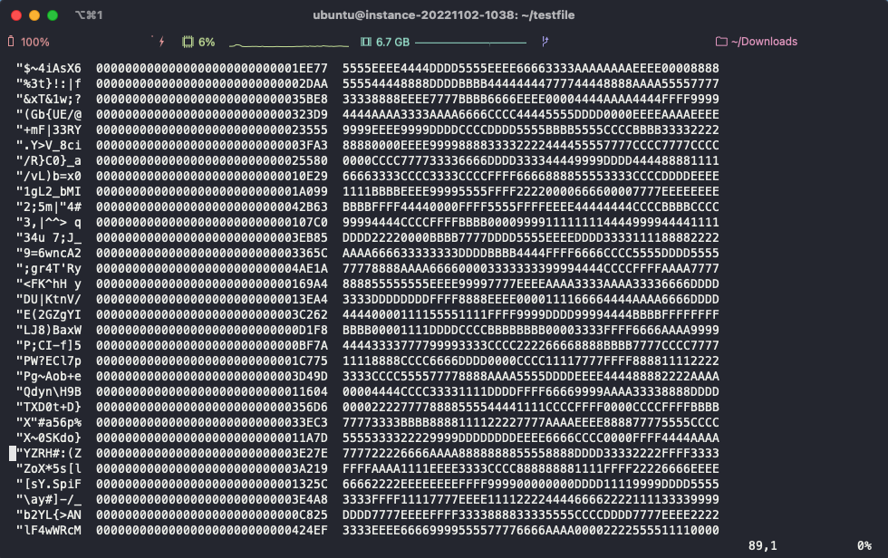
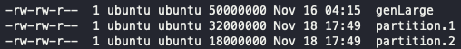

# 2022-11-18

## Progress in Previous Week
gRPC 적용 => Master Slave 구조 구현 및 통신 확인 + gRPC test code 작성 (진행 중)

Development Environment Setting and record troubleshooting (Done)

FileIO, Fragmentation(32MB) (Done)

Sorting Lexiographically (Done)

Progress Presentation (Done)

## Goal of the Week

Network 방식 gRPC 진행 (cf) 어려울 경우 TCP 고려...)

Partitioning, Merge-Sort Implementation

Testing Server(given by CS Dep.) JDK, Scala, SBT, etc. setting

## Goal of the Week for each Member
송수민: Partitioning, Merge-Sort Implementation  

임경빈: TO DO

염재후: ScalaPB documenatation, Message Design Proposal, SBT Dependency summarize

## Progress of this week
### Sumin Song
 - FileIO, Fragmentation(32MB) (Done)
  > Ubuntu 22.04에서 동작하는 것을 확인 하였으며, 32MB 단위로 나누어져 저장되는 것을 확인하였다. 또한, 나누어진 파일 크기의 합이 원래의 파일 크기와 같음을 확인하였다. <br>
  > 현 프로젝트에서 Scala 2.13.0을 사용하고 있는데, 이 버전을 Ubuntu에 설치 할 때 기존의 package program인 apt로는 설치가 불가능함을 확인하였다. 이를 해결하기 위해서는 SDKMAN이라는 package program을 사용하여야 하며 더불어 이것을 통해 JDK 11, SBT 또한 쉽게 적용할 수 있다. 이것의 또 다른 이점은 default version을 bash script가 아닌 CLI 명령어로 해결할 수 있다. <br>
  > Input specification을 적용하였다. PPT에서 주어진 input specification은 "slave <Master IP Address> -I {Input path1 to N} -O Output Path이며 현재 적용되고 있는 실행 명령은 "scala Worker <Master IP Address> {Input path1 to N} Output Path"이다. scala Worker -> slave로 변경하는 것은 추후에 적용하려고 한다. <br>
  > 몇 가지 우려되는 점으로는 현재 Fragmentation 구현 부분이 Scala스럽지는 않다. 솔직하게 말하면 C++에 가까운데, 이를 나중에 refactoring 할지에 대해서는 논의가 필요할 것 같다. 기능은 정상적으로 작동된다. <br>
- Sorting Lexiographically (Done)
  > 전 Phase에서 나눈 파일별로 sorting을 진행하였다. 분할된 파일을 새로 다시쓰는 방식으로 하여 partition.N이 정렬 된 상태로 다시 저장된다. Space character로 split을 할 시 key value로 space bar가 앞에 나오는 경우 key, value가 올바르게 분리되지 않아 문제가 생긴다. 이로 인해 split을 space character로 하지 않고 key size로 분류하여야 한다. 지금은 10자리로 지정해놓았지만, 일반성을 생각한다면 key size를 얻는 것이 필요해 보인다. <br>
- Shell script for testing and easy compile (Done)
  > 파일들을 초기화 하고 컴파일을 간편하기 위해 간단한 shell script를 적용하였다. 현재 사용하고 있는 shell script는 clean.sh / exe.sh등으로 각각 컴파일 된 결과들, 실행 결과물을 지우거나 컴파일 및 실행을 하는 shell script이다. <br>
- 아래는 위 사항들의 대한 결과물이다. <br>


### Kyungbin Lim
### gRPC

<aside>
💡 **[gRPC](https://grpc.io/)**는 구글에서 개발한 최신 오픈 소스 고성능 **RPC** 프레임워크이다.

</aside>

<aside>
💡 **RPC** : Remote Procedure Call의 약자로 별도의 원격 제어를 위한 코딩 없이 다른 주소 공간에서 함수나 프로시저를 실행할 수 있게하는 프로세스 간 통신 기술이다.

</aside>

### Introduction to gRPC

[Introduction to gRPC](https://grpc.io/docs/what-is-grpc/introduction/)

### Overview

gRPC에서는 클라이언트 어플리케이션이 서버 어플리케이션에 있는 메소드를 마치 자신의 로컬 오브젝트인 것처럼 호출할 수 있다. 여느 RPC 시스템과 마찬가지로 서비스 정의 개념에 기반을 두고 있으며 parameter와 return 타입을 가지고 원격으로 메소드를 호출할 수 있다. 서버는 이 인터페이스를 구현하고 gRPC서버를 실행하여 클라이언트 호출을 처리한다. 클라이언트는 서버와 동일한 메소드을 제공하는 stub을 가지고 있다.


### Protocol Buffers

구글에서 오픈소스로 공개한 언어, 구조화(structured)된 데이터를 직렬화(serialization) 하는 방식.

<aside>
💡 **직렬화(Serialization)** : 데이터 표현은 결국 비트와 바이트로 이루어짐. 데이터를 바이트 스트림으로 만드는 것도 직렬화, JSON이나 XML과 같은 일정한 표현 형식으로 만드는 것도 직렬화. 프로토콜 버퍼도 데이터를 직렬화시키는 포맷 중 하나.

</aside>

프로토콜 버퍼는 데이터의 크기가 작아 같은 시간에 더 많은 데이터를 보낼 수 있다. 또 별도의 파싱이 필요가 없다. 하지만 인간이 읽기 불편하며 proto파일이 있어야 읽을 수 있다는 단점이 있다. 즉 모든 클라이언트가 proto 파일이 있어야 하므로 내부 서비스간 데이터 교환에서 주로 쓰인다.

### JSON(JavaScript Object Notation)

- 데이터를 저장하거나 전송할 때 많이 사용되는 **경량의 DATA 교환 형식**, 즉 객체를 만들 때 사용하는 표현식을 의미한다.
- JSON은 데이터 포맷일 뿐이며 어떠한 통신 방법도, 프로그래밍 문법도 아닌 단순히 데이터를 표시하는 표현 방법일 뿐이다.

```python
{
  "employees": [
    {
      "name": "Surim",
      "lastName": "Son"
    },
    {
      "name": "Someone",
      "lastName": "Huh"
    },
    {
      "name": "Someone else",
      "lastName": "Kim"
    } 
  ]
}
```

### Working with Protocol Buffers

기본적으로 gRPC는 구조화된 데이터를 직렬화하기 위해 구글의 오픈 소스 메커니즘인 프로토콜 버퍼를 사용한다.

프로토콜 버퍼로 작업할 때 먼저 프로토콜 파일에서 직렬화할 데이터의 구조를 정의한다. 이것은 .proto 확장자를 가진 일반 텍스트 파일.

```java
message Person {
  string name = 1;
  int32 id = 2;
  bool has_ponycopter = 3;
}
```

gRPC에서 사용할 protobuf의 대략적인 모습은 아래와 같다.

```java
syntax = "proto3";

package ecommerce;

service ProductInfo {
    rpc addProduct(Product) returns (ProductID);
    rpc getProduct(ProductID) returns (Product);
}

message Product {
    string id = 1;
    string name = 2;
    string description = 3;
    float price = 4;
}

message ProductID {
    string value = 1;
}
```

자바 기준으로 `service`는 `interface`에 있는 추상메서드 라고 생각하면 편하고 `message`는 Dto, 값 객체라고 생각하면 편하다.

이제 작성한 이 .proto을 각각 언어에 맞는 protoc를 사용해서 컴파일한뒤에 서버측에서는 미리 정의한 `service` 의 구현체를 작성하고 클라이언트에서는 제공되는 `service`의 stub 객체를 활용해서 통신하면 된다.

### gRPC Examples

### gRPC Quick start

[Quick start](https://grpc.io/docs/languages/java/quickstart/)

위 링크에서 gRPC example 프로그램을 다운받아 컴파일하고 실행하였다.


## Update the gRPC service

gRPC 서비스는 프로토콜 버퍼 인터페이스를 사용하고 있기 때문에, 서버와 클라이언트 모두 proto 파일에 코드를 작성함으로써 서비스를 디파인할 수 있다.

```java
// The greeting service definition.
service Greeter {
  // Sends a greeting
  rpc SayHello (HelloRequest) returns (HelloReply) {}
}

// The request message containing the user's name.
message HelloRequest {
  string name = 1;
}

// The response message containing the greetings
message HelloReply {
  string message = 1;
}
```

src/main/proto 디렉토리에 proto 파일들 존재. 여기에서 서비스 디파인.

프로그램 빌드 후 src/main/java/io/grpc/examples에서 서버용 자바파일과 클라이언트용 자바파일에 각각 코드 삽입.

**서버용 자바파일**

```java
private class GreeterImpl extends GreeterGrpc.GreeterImplBase {

  @Override
  public void sayHello(HelloRequest req, StreamObserver<HelloReply> responseObserver) {
    HelloReply reply = HelloReply.newBuilder().setMessage("Hello " + req.getName()).build();
    responseObserver.onNext(reply);
    responseObserver.onCompleted();
  }

  @Override
  public void sayHelloAgain(HelloRequest req, StreamObserver<HelloReply> responseObserver) {
    HelloReply reply = HelloReply.newBuilder().setMessage("Hello again " + req.getName()).build();
    responseObserver.onNext(reply);
    responseObserver.onCompleted();
  }
}
```

**클라이언트용 자바파일**

```java
public void greet(String name) {
  logger.info("Will try to greet " + name + " ...");
  HelloRequest request = HelloRequest.newBuilder().setName(name).build();
  HelloReply response;
  try {
    response = blockingStub.sayHello(request);
  } catch (StatusRuntimeException e) {
    logger.log(Level.WARNING, "RPC failed: {0}", e.getStatus());
    return;
  }
  logger.info("Greeting: " + response.getMessage());
  try {
    response = blockingStub.sayHelloAgain(request);
  } catch (StatusRuntimeException e) {
    logger.log(Level.WARNING, "RPC failed: {0}", e.getStatus());
    return;
  }
  logger.info("Greeting: " + response.getMessage());
}
```

**실행화면**


### gRPC basic tutorial

### Defining the service

proto 파일에서 서비스 디파인. 이때 자바 패키지(자바 클래스 모음)를 명시할 수 있다.

```java
option java_package = "io.grpc.examples.routeguide";
```

service를 통해 서비스를 디파인할 수 있다.

```java
service RouteGuide {
   ...
}
```

서비스 데피니션 안에서 rpc 메소드를 정의한다. 이때 request와 response 타입을 지정한다. gRPC에서는 서버와 클라이언트에 따라 4가지 rpc 형태를 정의하고 있다.

```java
// Obtains the feature at a given position.
rpc GetFeature(Point) returns (Feature) {}
```

proto 파일에서 protocol buffer message 타입을 정의한다. 위 rpc 예시에서 Point라는 타입을 아래와 같이 정의한다.

```java
// Points are represented as latitude-longitude pairs in the E7 representation
// (degrees multiplied by 10**7 and rounded to the nearest integer).
// Latitudes should be in the range +/- 90 degrees and longitude should be in
// the range +/- 180 degrees (inclusive).
message Point {
  int32 latitude = 1;
  int32 longitude = 2;
}
```

- **A *simple RPC** :* where the client sends a request to the server using the stub and waits for a response to come back, just like a normal function call.
- **A *server-side streaming RPC :*** where the client sends a request to the server and gets a stream to read a sequence of messages back. The client reads from the returned stream until there are no more messages. As you can see in our example, you specify a server-side streaming method by placing the `stream`
 keyword before the *response*
 type.
- **A *client-side streaming RPC :*** where the client writes a sequence of messages and sends them to the server, again using a provided stream. Once the client has finished writing the messages, it waits for the server to read them all and return its response. You specify a client-side streaming method by placing the `stream`
 keyword before the *request*
 type.
- **A *bidirectional streaming RPC :*** where both sides send a sequence of messages using a read-write stream. The two streams operate independently, so clients and servers can read and write in whatever order they like: for example, the server could wait to receive all the client messages before writing its responses, or it could alternately read a message then write a message, or some other combination of reads and writes. The order of messages in each stream is preserved. You specify this type of method by placing the `stream`
 keyword before both the request and the response.

### Generation client and server code

protoc이라는 프로토콜 버퍼 컴파일러 사용. 

### Creating the server

1. service 데피니션으로부터 서비스 베이스 클래스 오버라이딩하여 actual work 만들기
2. gRPC서버를 실행하여 클라이언트의 리퀘스트 듣고 서비스 response하기

```java
@Override
public void getFeature(Point request, StreamObserver<Feature> responseObserver) {
  responseObserver.onNext(checkFeature(request));
  responseObserver.onCompleted();
}
```

getFeature() 메소드는 두개의 파라미터를 가진다. point는 클라이언트의 request이며 StreamObserver<Feature>는 response observer이며 서버가 response를 call할때 사용하는 특별한 인터페이스이다.

responseObserver.onNext()를 통해 리턴을 하고, responseObserver.onCompleted()를 통해 RPC가 끝났음을 명시한다.

### Starting the server

서버에서 필요한 메소드를 전부 구현했다면, gRPC서버를 구동하여 클라이언트가 서비스를 사용하도록 해야한다. 

```java
public RouteGuideServer(int port, URL featureFile) throws IOException {
  this(ServerBuilder.forPort(port), port, RouteGuideUtil.parseFeatures(featureFile));
}

/** Create a RouteGuide server using serverBuilder as a base and features as data. */
public RouteGuideServer(ServerBuilder<?> serverBuilder, int port, Collection<Feature> features) {
  this.port = port;
  server = serverBuilder.addService(new RouteGuideService(features))
      .build();
}
...
public void start() throws IOException {
  server.start();
  logger.info("Server started, listening on " + port);
 ...
}
```

### Creating the client

서비스 메소드를 호출하기 위해서는 stub라는 것을 만들어야 한다. 

stub를 위한 gRPC 채널을 만들어 서버 주소와 포트를 명시한다.

```java
public RouteGuideClient(String host, int port) {
  this(ManagedChannelBuilder.forAddress(host, port).usePlaintext());
}

/** Construct client for accessing RouteGuide server using the existing channel. */
public RouteGuideClient(ManagedChannelBuilder<?> channelBuilder) {
  channel = channelBuilder.build();
  blockingStub = RouteGuideGrpc.newBlockingStub(channel);
  asyncStub = RouteGuideGrpc.newStub(channel);
}
```

이제 위에서 명시한 채널을 이용해 newStub와 newBlockingStub 메소드를 가지고 stub를 정의한다.

```java
blockingStub = RouteGuideGrpc.newBlockingStub(channel);
asyncStub = RouteGuideGrpc.newStub(channel);
```

이제 네가지 유형 중 알맞게 서비스 메소드를 구현하면 된다.

```java
Point request = Point.newBuilder().setLatitude(lat).setLongitude(lon).build();
Feature feature;
try {
  feature = blockingStub.getFeature(request);
} catch (StatusRuntimeException e) {
  logger.log(Level.WARNING, "RPC failed: {0}", e.getStatus());
  return;
}
```

 ### Jaehu Yeom
 ## Data Type

데이터를 바이너리로 인코딩하는 방식

`.proto` 파일에서 데이터를 직렬화한다. protobuf에서 데이터는 message 타입으로 구조화되며, messgae type 안에는

<Type><name> = unique_number 꼴의 logical한 멤버가 있다.

e.g.

```protobuf
message Person {
required string name = 1;
optional int32 id = 2 [default = _value];
repeated bool has_ponycopter = 3;
}
```

이렇게 message를 만들고 나면 protobuf compiler `protoc` 를 호출하여, 우리가 원하는 언어로 작성된 프로그램에서 data access classes를 만들어준다. `name()` or `set_name()` 을 통해서 각 데이터 멤버에 대해서 접근/수정이 가능하고, 우리 프로그램에서는 객체로서 접근할 수 있다.(객체지향이 아닌 경우는 따로 찾아봐야 함)

unique number (in this case, 1,2,3)은 한 번 정의하면 바꾸지 않고 일관되게 사용해야 한다. 각 필드를 인코딩하는데 필요하며 1~15까지는 1byte, 16~2047까지는 2byte를 사용한다고 한다. 

각 field는 singular, repeated가 있는데 단순히 singular는 하나의 변수, repeated는 동적 배열이라고 생각하자. (protobuf3 기준이다!)

**repeated**의 경우, 아마 우리가 자주 쓰게 될 것 같은데, 해당 값이 여러번 반복되는 경우이다.

protoc가 컴파일을 하면서 해당 메세지에 맞는 메소드들을 생성하게 되는데 자세한 것은 

[https://developers.google.com/protocol-buffers/docs/reference/cpp-generated#repeatednumeric](https://developers.google.com/protocol-buffers/docs/reference/cpp-generated#repeatednumeric)

이 페이지를 참조하고, 우리가 자주 쓰게 될 것 같은 repeated에 대해서 소개한다.

(이 field에만 해당하는 몇 메소드들도 있으니 조심하자.)

let `repeated string foo = 1;`

- `int foo_size() const`: Returns the number of elements currently in the field.
    - return 사이즈
- `const string& foo(int index) const`: Returns the element at the given zero-based index. Calling this method with index outside of [0, foo_size()) yields undefined behavior.
    - return foo[index] (index starts with 0)
- `void set_foo(int index, const string& value)`: Sets the value of the element at the given zero-based index.
    - foo[index] = value
- `void set_foo(int index, const char* value)`: Sets the value of the element at the given zero-based index using a C-style null-terminated string.
    - foo = value, ( |value| = index )
- `void set_foo(int index, const char* value, int size)`: Like above, but the string size is given explicitly rather than determined by looking for a null-terminator byte.
    - fixed size setting.
- `string* mutable_foo(int index)`: Returns a pointer to the mutable `string` object that stores the value of the element at the given zero-based index. Calling this method with index outside of [0, foo_size()) yields undefined behavior.
    - return mutable foo[index], 즉 foo[index]에 대한 포인터가 온다.
- `void add_foo(const string& value)`: Appends a new element to the end of the field with the given value.
    - foo.append(value array)
- `void add_foo(const char* value)`: Appends a new element to the end of the field using a C-style null-terminated string.
    - C-style appending ⇒ 우리랑 관계X
- `void add_foo(const char* value, int size)`: Like above, but the string size is given explicitly rather than determined by looking for a null-terminator byte.
    - fixed size appending
- `string* add_foo()`: Adds a new empty string element to the end of the field and returns a pointer to it.
    - return end of array pointer ⇒ 마음대로 append할 수 있게 하는듯
- `void clear_foo()`: Removes all elements from the field. After calling this, `foo_size()` will return zero.
    - remove(foo)
- `const [RepeatedPtrField](https://developers.google.com/protocol-buffers/docs/reference/cpp/google.protobuf.repeated_field#RepeatedPtrField)<string>& foo() const`: Returns the underlying `[RepeatedPtrField](https://developers.google.com/protocol-buffers/docs/reference/cpp/google.protobuf.repeated_field#RepeatedPtrField)` that stores the field's elements. This container class provides STL-like iterators and other methods.
    - const foo를 준다.
- `[RepeatedPtrField](https://developers.google.com/protocol-buffers/docs/reference/cpp/google.protobuf.repeated_field#RepeatedPtrField)<string>* mutable_foo()`: Returns a pointer to the underlying mutable `[RepeatedPtrField](https://developers.google.com/protocol-buffers/docs/reference/cpp/google.protobuf.repeated_field#RepeatedPtrField)` that stores the field's elements. This container class provides STL-like iterators and other methods.
    - mutable foo를 준다.

# protobuf in Scala: ScalaPB

## Installation

> 아래의 사이트를 참조하였음
[https://scalapb.github.io/docs/sbt-settings/](https://scalapb.github.io/docs/sbt-settings/)
> 

project/plugins.sbt에 다음의 코드 추가

```scala
addSbtPlugin("com.thesamet" % "sbt-protoc" % "1.0.3")

libraryDependencies += "com.thesamet.scalapb" %% "compilerplugin" % "0.11.11"
```

/build.sbt에 다음의 코드 추가

```scala
import sbt.project

Compile / PB.targets := Seq(
  scalapb.gen() -> (Compile / sourceManaged).value / "scalapb"
)
```

⇒ `compile` in sbt shell을 하면 .proto 파일을 실행해 source를 만들고 컴파일해준다.

⇒ compile하고 싶지 않다면, sbt shell에서 `run protocGenerate` 할 것!

## How to Use

### 경로

기본적으로 src/main/protobuf에 .proto files가 있다고 가정하지만

`Compile / PB.protoSources` setting.에서 변경할 수 있다.
 
 **Error Handling**
 ## Cannot Resolve symbol…

플러그인 추가하라고 해서 다 넣었는데 symbol을 모르겠다고 한다.

> .idea directory를 지운다.
build.sbt에 import sbt.project를 넣는다.
