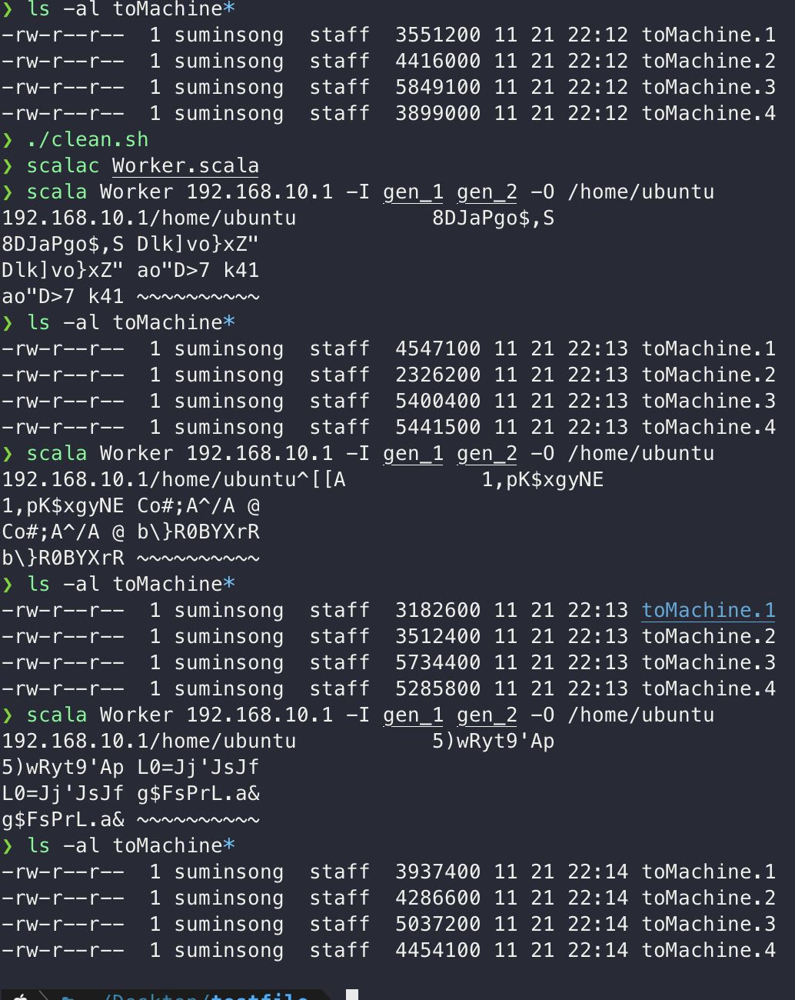
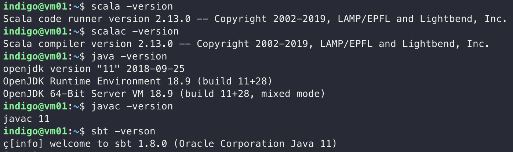
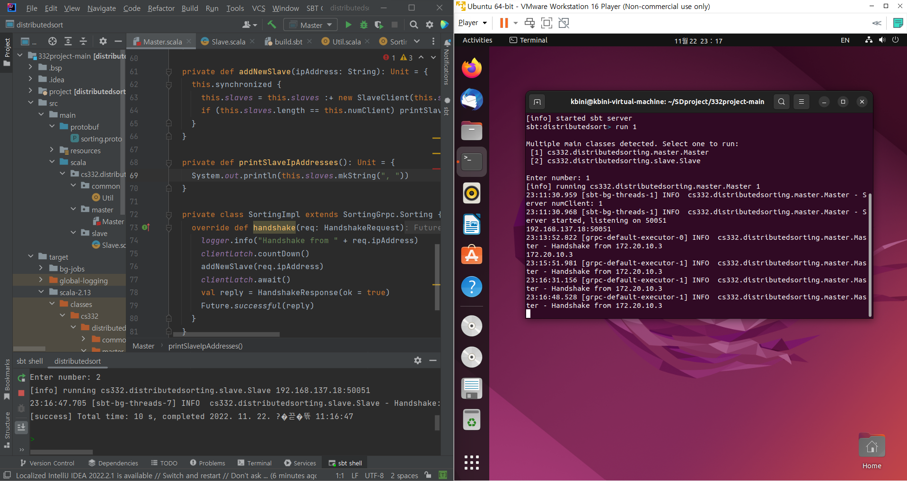
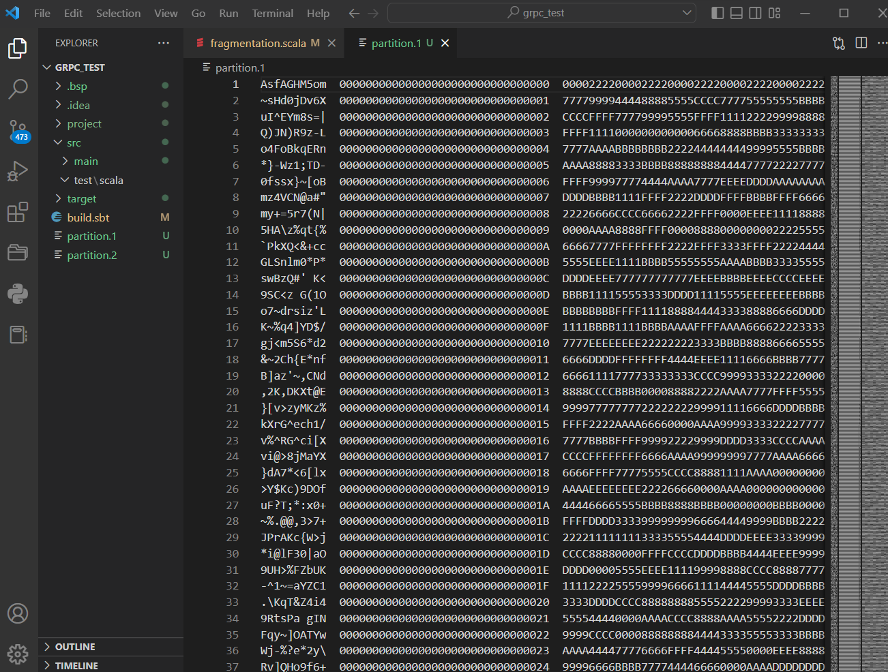

# 2022-11-26

## Progress in Previous Week
gRPC 적용 => Master Slave 구조 구현 및 통신 확인 + gRPC test code 작성 (Done)

Partitioning, Merge 구현 (Done)

전체적인 Worker structure code 구현 (Done)

Testing server JDK 11, Scala 2.13.0 Setting (Done)

## Goal of the Week

Worker Structure Code를 바탕으로 한 각 Phase 완성 = Worker + Connection(gRPC)

Test 방법 고안 및 Test Code 작성

## Goal of the Week for each Member
송수민: Worker - gRPC Connection 구현

임경빈: Fragmentation 파트 gRPC를 이용한 구현

염재후: Master와 Worker간의 Flow Control 방법 찾기 (수요일까지)
이후, 찾은 결과에 따라서, Sampling을 

## Progress of this week
### Sumin Song
 - Partitioning, Merge (Done)
 > Sampling을 기반으로 하여 각 key - value를 partitioning을 진행하였고, 이를 확인하였다. => 현재 network connection이 구현되지 않아, 각 machine별로는 확인을 하지 못하였지만, machine이 여러개 있다고 가정하고 분류하였을 때 올바르게 작동하는 것을 확인하였다.  
> 위의 가정으로 진행하였을 때, partitioning 되어 분류된 데이터를 merge & sorting하였고, 이를 확인하였다. 하지만, 이 과정에서 random sampling이 이루어질 경우 data size skewness가 발생하는 것을 확인하였다. Sampling 양이 많아진다면 어떨지 모르겠지만, 만약을 대비하여 sampling을 인위적으로 진행해보았다. 현재 key의 범위는 " "(White space) ~ "~"인데 만약 4개의 machine이 있다고 가정하고 4개의 범위로 나누어 이 범위들을 range라 하였을 때, data size가 balance하게 나오는 것을 확인하였다. 방법을 강구해보다가 만약 해결되지 못하면 이 방법 또한 고려해야 할 것 같다.
- Testing Server JDK 11, Scala 2.13.0 Setting (Done)
> 학교 클러스터 서버에 우리 조 개발 환경에 맞게 JDK 11, Scala 2.13.0을 설치하였다. 이를 통해 테스트를 진행할 수 있게 되었다.
- 아래는 위 사항들의 대한 결과물이다.  
  

### Gyeongbhin Lim

 - gRPC connection between different machines (Done)
    - gRPC 라이브러리를 이용하여 서버와 클라이언트 구현. 
    - 로컬과 VM에서 각각 서버와 클라이언트 코드 실행. 로컬에서는 서버를 실행하고 VM 상에서 서버의 IP 주소와 포트 전달. 
    
     

     

     

    - 정상적으로 연결 확인. 
    
     

 - Test running a method code implemented in Worker class (Done)

     

    -  Worker 클래스 내 송수민 부원이 구현한 fragmentation 메소드 코드 작성, 클라이언트 오브젝트를 실행시키면서 정상적으로 코드가 작동하는지 확인.
    - src/main/scala 디렉토리에 master와 worker를 구현한 network 패키지와 같은 계층으로 프로그램의 각 phase인 fragment, sorting, partition, balancing 등의 패키지 구조 구축
    - 코드를 테스트 해보기 위해 fragment 패키지에서 이미 구현 된 fragment class를 옮겨오고, worker class 파일에서 이를 참조하도록 함.
    - worker class에서 fragment에서 사용되는 함수 중 하나인 splitFile() 메소드를 override하고 worker object에 있는 main에서 메소드를 호출하였음.
    - 실행 결과 예상대로 지정한 경로를 따라 genLarge 파일을 분할 후 partition.1과 partition.2 파일이 생성되었음. 

     

     

     

    - 이를 응용하여 프로그램 구현에 필요한 메소드들을 같은 방식으로 추가할 예정.  

### Jaehu Yeom
 SBT build system에 대한 documentation 작성 완료
 
 Message Design Balancing을 제외하고 완료.
 - gRPC 연결 방식에 따라 메세징 방법이 바뀔 수 있기 때문에 fragment와 sampling관련 message만 추가
 - Enumeration 추가(for Phase)
 - CountDownLatch를 통한 Master의 Control을 Flow하도록 설계
=> 쉽게 구현할 수 있을 것으로 예측되지만, 코드가 복잡해질 예정. 다른 방법을 수요일까지 찾아보고, 그래도 없으면 Latch를 사용할 

