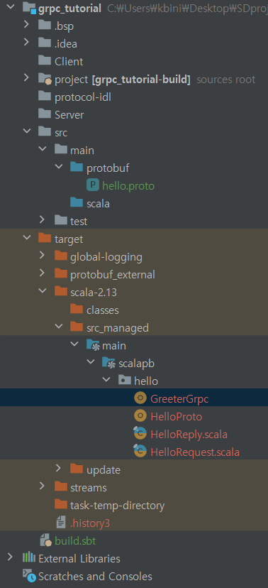
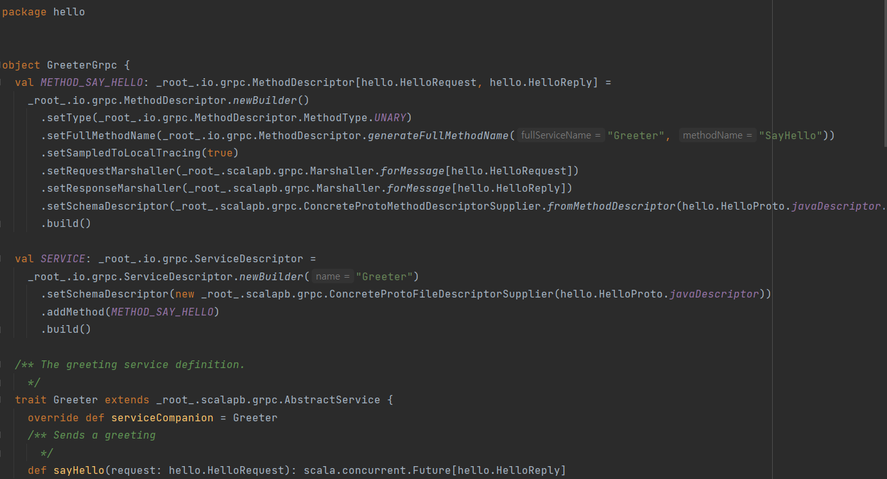

# 2022-11-18

## Progress in Previous Week
gRPC 적용 => Master Slave 구조 구현 및 통신 확인 + gRPC test code 작성 (Done)

Partitioning, Merge 구현 (Done)

전체적인 Worker structure code 구현 (Done)

Testing server JDK 11, Scala 2.13.0 Setting (Done)

## Goal of the Week

Worker Structure Code를 바탕으로 한 각 Phase 완성 = Worker + Connection(gRPC)

Test 방법 고안 및 Test Code 작성

## Goal of the Week for each Member
송수민: Worker - gRPC Connection 구현

임경빈: TODO

염재후: TODO

## Progress of this week
### Sumin Song
 - Partitioning, Merge (Done)
 > Sampling을 기반으로 하여 각 key - value를 partitioning을 진행하였고, 이를 확인하였다. => 현재 network connection이 구현되지 않아, 각 machine별로는 확인을 하지 못하였지만, machine이 여러개 있다고 가정하고 분류하였을 때 올바르게 작동하는 것을 확인하였다. <br>
> 위의 가정으로 진행하였을 때, partitioning 되어 분류된 데이터를 merge & sorting하였고, 이를 확인하였다. 하지만, 이 과정에서 random sampling이 이루어질 경우 data size skewness가 발생하는 것을 확인하였다. Sampling 양이 많아진다면 어떨지 모르겠지만, 만약을 대비하여 sampling을 인위적으로 진행해보았다. 현재 key의 범위는 " "(White space) ~ "~"인데 만약 4개의 machine이 있다고 가정하고 4개의 범위로 나누어 이 범위들을 range라 하였을 때, data size가 balance하게 나오는 것을 확인하였다. 방법을 강구해보다가 만약 해결되지 못하면 이 방법 또한 고려해야 할 것 같다.
- Testing Server JDK 11, Scala 2.13.0 Setting (Done)
> 학교 클러스터 서버에 우리 조 개발 환경에 맞게 JDK 11, Scala 2.13.0을 설치하였다. 이를 통해 테스트를 진행할 수 있게 되었다.
- 아래는 위 사항들의 대한 결과물이다. <br>
 <br>

### Gyeongbhin Lim
<br>

### gRPC code using ScalaPB 
<br>

- 스칼라 프로젝트 src/main/protobuf 디렉토리에 proto 파일을 생성.
- 서비스와 메세지 선언.

```scala
syntax = "proto3";

// The greeting service definition.
service Greeter {
  // Sends a greeting
  rpc SayHello (HelloRequest) returns (HelloReply) {}
}

// The request message containing the user's name.
message HelloRequest {
  string name = 1;
}

// The response message containing the greetings
message HelloReply {
  string message = 1;
}
```
<br>

- 프로젝트 build.sbt에 grpc와 scalapb 디펜던시 추가

```scala
libraryDependencies ++= Seq(
  "io.grpc" % "grpc-netty" % scalapb.compiler.Version.grpcJavaVersion,
  "com.thesamet.scalapb" %% "scalapb-runtime-grpc" % scalapb.compiler.Version.scalapbVersion
)
```
<br>

- scala protocol buffer를 이용하여 컴파일. proto 파일에서 선언한 서비스를 구현하기 위한 스칼라 코드들을 생성.  




- 생성된 코드들을 이용해 서버와 클라이언트를 구현하고자 했으나 스칼라를 이용한 grpc관련 정보들을 찾기 어려워 
우선 다른 언어로 쓰여진 코드를 먼저 분석한 이후 스칼라로 코드를 작성하기로 하였다. 


.
### Feedbacks during 11/17 presentation
<br>

- Milestone은 boolean한 값이 나오도록, 개발자를 속일 수 없도록, 구체적이고 명료하게 세워야 하는 것이다.

- Milestone의 구체화 필요, 팀원간 충분한 소통으로 인터페이스 포맷 통일, git을 이용한 각자의 branch에 코드를 commit하여 버전 관리

- High level의 디자인 보다는 구체적인 데이터 포맷과 메소드 인터페이스를 documentation해야 함.

- 실제로 데이터는 uniform에 가까운 분포를 보일 것이니 구현 전부터 skewed data에 대한 대응을 고려하는 것은 불필요해 보임. 하나의 디스크에 존재하는 데이터를 sorting하는 알고리즘을 먼저 구현하고 영역을 넓혀보는 방식 제안.

- 효율적인 프로그램 개발을 위해 서로 파트를 잘 배분하고 사전에 정한 디자인에 따라 코드를 잘 짠 뒤 통합하는 과정이 필요하다.

<br>

### Jaehu Yeom
 ## Data Type

데이터를 바이너리로 인코딩하는 방식

`.proto` 파일에서 데이터를 직렬화한다. protobuf에서 데이터는 message 타입으로 구조화되며, messgae type 안에는

<Type><name> = unique_number 꼴의 logical한 멤버가 있다.

e.g.

```protobuf
message Person {
required string name = 1;
optional int32 id = 2 [default = _value];
repeated bool has_ponycopter = 3;
}
```

이렇게 message를 만들고 나면 protobuf compiler `protoc` 를 호출하여, 우리가 원하는 언어로 작성된 프로그램에서 data access classes를 만들어준다. `name()` or `set_name()` 을 통해서 각 데이터 멤버에 대해서 접근/수정이 가능하고, 우리 프로그램에서는 객체로서 접근할 수 있다.(객체지향이 아닌 경우는 따로 찾아봐야 함)

unique number (in this case, 1,2,3)은 한 번 정의하면 바꾸지 않고 일관되게 사용해야 한다. 각 필드를 인코딩하는데 필요하며 1~15까지는 1byte, 16~2047까지는 2byte를 사용한다고 한다. 

각 field는 singular, repeated가 있는데 단순히 singular는 하나의 변수, repeated는 동적 배열이라고 생각하자. (protobuf3 기준이다!)

**repeated**의 경우, 아마 우리가 자주 쓰게 될 것 같은데, 해당 값이 여러번 반복되는 경우이다.

protoc가 컴파일을 하면서 해당 메세지에 맞는 메소드들을 생성하게 되는데 자세한 것은 

[https://developers.google.com/protocol-buffers/docs/reference/cpp-generated#repeatednumeric](https://developers.google.com/protocol-buffers/docs/reference/cpp-generated#repeatednumeric)

이 페이지를 참조하고, 우리가 자주 쓰게 될 것 같은 repeated에 대해서 소개한다.

(이 field에만 해당하는 몇 메소드들도 있으니 조심하자.)

let `repeated string foo = 1;`

- `int foo_size() const`: Returns the number of elements currently in the field.
    - return 사이즈
- `const string& foo(int index) const`: Returns the element at the given zero-based index. Calling this method with index outside of [0, foo_size()) yields undefined behavior.
    - return foo[index] (index starts with 0)
- `void set_foo(int index, const string& value)`: Sets the value of the element at the given zero-based index.
    - foo[index] = value
- `void set_foo(int index, const char* value)`: Sets the value of the element at the given zero-based index using a C-style null-terminated string.
    - foo = value, ( |value| = index )
- `void set_foo(int index, const char* value, int size)`: Like above, but the string size is given explicitly rather than determined by looking for a null-terminator byte.
    - fixed size setting.
- `string* mutable_foo(int index)`: Returns a pointer to the mutable `string` object that stores the value of the element at the given zero-based index. Calling this method with index outside of [0, foo_size()) yields undefined behavior.
    - return mutable foo[index], 즉 foo[index]에 대한 포인터가 온다.
- `void add_foo(const string& value)`: Appends a new element to the end of the field with the given value.
    - foo.append(value array)
- `void add_foo(const char* value)`: Appends a new element to the end of the field using a C-style null-terminated string.
    - C-style appending ⇒ 우리랑 관계X
- `void add_foo(const char* value, int size)`: Like above, but the string size is given explicitly rather than determined by looking for a null-terminator byte.
    - fixed size appending
- `string* add_foo()`: Adds a new empty string element to the end of the field and returns a pointer to it.
    - return end of array pointer ⇒ 마음대로 append할 수 있게 하는듯
- `void clear_foo()`: Removes all elements from the field. After calling this, `foo_size()` will return zero.
    - remove(foo)
- `const [RepeatedPtrField](https://developers.google.com/protocol-buffers/docs/reference/cpp/google.protobuf.repeated_field#RepeatedPtrField)<string>& foo() const`: Returns the underlying `[RepeatedPtrField](https://developers.google.com/protocol-buffers/docs/reference/cpp/google.protobuf.repeated_field#RepeatedPtrField)` that stores the field's elements. This container class provides STL-like iterators and other methods.
    - const foo를 준다.
- `[RepeatedPtrField](https://developers.google.com/protocol-buffers/docs/reference/cpp/google.protobuf.repeated_field#RepeatedPtrField)<string>* mutable_foo()`: Returns a pointer to the underlying mutable `[RepeatedPtrField](https://developers.google.com/protocol-buffers/docs/reference/cpp/google.protobuf.repeated_field#RepeatedPtrField)` that stores the field's elements. This container class provides STL-like iterators and other methods.
    - mutable foo를 준다.

# protobuf in Scala: ScalaPB

## Installation

> 아래의 사이트를 참조하였음
[https://scalapb.github.io/docs/sbt-settings/](https://scalapb.github.io/docs/sbt-settings/)
> 

project/plugins.sbt에 다음의 코드 추가

```scala
addSbtPlugin("com.thesamet" % "sbt-protoc" % "1.0.3")

libraryDependencies += "com.thesamet.scalapb" %% "compilerplugin" % "0.11.11"
```

/build.sbt에 다음의 코드 추가

```scala
import sbt.project

Compile / PB.targets := Seq(
  scalapb.gen() -> (Compile / sourceManaged).value / "scalapb"
)
```

⇒ `compile` in sbt shell을 하면 .proto 파일을 실행해 source를 만들고 컴파일해준다.

⇒ compile하고 싶지 않다면, sbt shell에서 `run protocGenerate` 할 것!

## How to Use

### 경로

기본적으로 src/main/protobuf에 .proto files가 있다고 가정하지만

`Compile / PB.protoSources` setting.에서 변경할 수 있다.
 
 **Error Handling**
 ## Cannot Resolve symbol…

플러그인 추가하라고 해서 다 넣었는데 symbol을 모르겠다고 한다.

> .idea directory를 지운다.
build.sbt에 import sbt.project를 넣는다.
