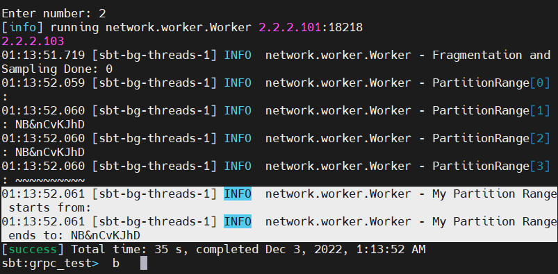
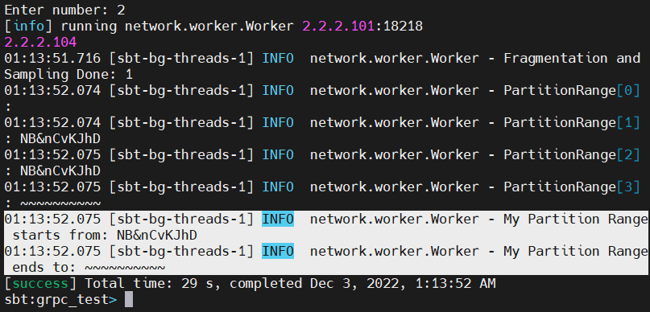

# 2022-12-04

## Progress in Previous Week
Worker Structure Code를 바탕으로 한 각 Phase 완성 = Worker + Connection(gRPC) (5개의 Phase 중 3개의 Phase 완료 / 4번째 Phase 진행 중)

Test 방법 고안 및 Test Code 작성 (Incomplete)

## Goal of the Week
Final Week - Complete Implementation 

Test 방법 고안 및 Test Code 작성 
## Goal of the Week for each Member
송수민: Implemenation / Test Code 

임경빈: Implemention of all phase / Meet requirements

염재후: Implement to force the execution sequence of Multi-client connection. Add protobuf and skeleton code following predefined program order.

## Progress of this week
### Sumin Song
 - Phase 1: Master의 Reply를 받은 Worker가 Phase 1: Fragementation을 진행하는 과정 확인 => Input Specification에 따르면 Input path가 directory인 것 확인, 수정 필요.
 - 동일 네트워크 망을 사용하여도 연결이 되지 않는 문제 해결 => Port Forwarding이 필요해 보이나, 제공 받은 Cluster 서버 사용으로 해결.
### Gyeongbhin Lim

 - Sumin의 코드에서 이어 받아 Fragmentation된 데이터에서 일부를 샘플링하고 마스터에 보낸 후, 마스터가 이를 정렬하여 각 워커에게 적절한 range를 보내는 과정까지 완료

 - 
 
 -  

 - gRPC에서 repeated 데이터 타입을 전송하기 위해 List와 ListBuffer를 이용하여 테스트 : Seq과 List는 정상적으로 보내졌지만 Scala.ListBuffer 는 지원하지 않음을 확인. => ListBuffer의 메소드인 ToList를 활용.

### Jaehu Yeom
 
 남은 Message define 완료.
 - blocking stub with 
 - Enumeration 추가(for Phase)
 - CountDownLatch를 통한 Master의 Control을 Flow하도록 설계
 - Psuedocode 

